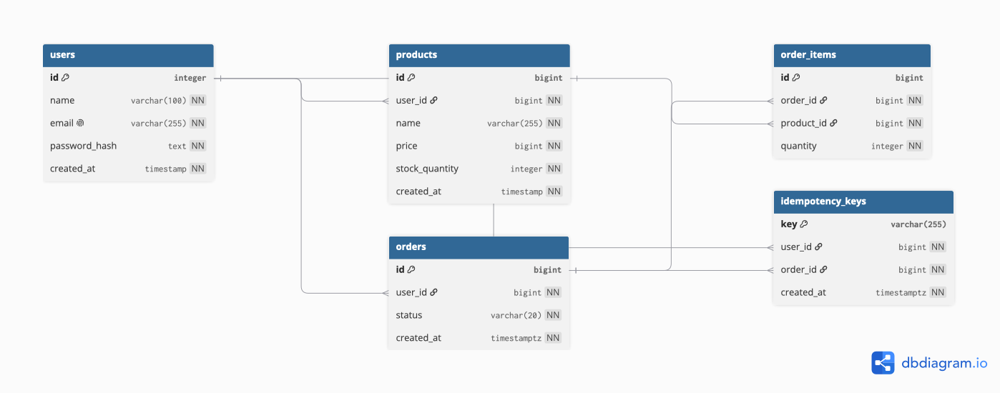

## Comment fd1aa53 gacha bolgan ishlarni va birinchi bussines logic ni techinical tushintirish

Birinchi main.go dan tushintirsam (/cmd/api) ni icida configlar yigiladi config faqat main.go asosiy filedan bajariladi. ikkinchi qadamda server  yaratiladi. va mux hamma routerlarni serverga beramiz. shundan keyin ularni run qilamiz.

main.go > database.new() -> Store.NewStore(db)(Bu yerda Product, Order/User repolari) -> services.NewServices()-> user.NewHandler(svc) -> app.ServeHTTP (bu yerda handler routerga boglanadi.)

Runtime tartibida, http sorov yuboriladi -> chi router (server/routes.go) -> middleware (Bu yerda logger, recoverer, RequireAuth va JWT tekshiruvi bor) -> Handler (jsoni oqish status code va error sodir bolsa uni togri error message bilan qaytarish kabi vazifalarni bajaradi.)-> Service ->biznes mantiq-> repository faqat SQL -> PosgreSQL ga tushadi 


## Comment 6eec0bf gacha bolgan ishlarni tushuntmasi

### CreateOrder /internal/order/repositry
CreateOrder Reposity chuntirishdan boshladim chunki handler va service kayerlar deyarli birhil, asosiy logika bu repository layerda, ishni boshlashda birinchi ishni tranzaksiyadan boshladim, chunki bitta functionda bir nechta database operationlar boladi jumladan, Order yaratish, Orderni Itemlarini yaratish, Stockni kamaytirish. endi detail bilan tushintiraman, birinchi tranzaksiya yaratilgandan song  QueryRowContext orqali bitta rowni olish uchun ishlatdim va  idempotency_keys mavjud bolsa bizga qayataradi shuningdek "user_id = $2" qismida oziga tegishli orderniyam olish logicasi yani idor protection ulangan. Undan keyin biz err sql.ErrNoRows shu qism order topilmadi degan qism shu yerda boladi.  shundan keyin Order yaratamiz INSERT qilish orqali.

 keyingi qadamda har bitta itemni insert qilib product id va quantyty qoshib insert qilamiz, va shundan keyin stockni kamaytimariz update va quantytni stockdaki quantitydan ayiramiz. RowsAffected orqali tekshiramiz row agar 0 bolsa ErrInsufficientStock hato tashaydi. va shundan keyin idempotency_keys yaratamiz. keyin tranzaksiyani commit qilib yopamiz


### GetOrder /internal/order/repositry
bu yerda logic odiyroq, faqat orderId va userid orqali idor qilish orqali userga tegishli orderni olamiz


### CancelOrder /internal/order/repositry

bu yerdaham bir nechta database operationlari bolganligi tufayli tranzaktion ochamiz. keyin Statusni tekshiramiz approved/rejected bols cancel qila olmaymiz., keyingi queryda stockdaki mahsulot sonini qaytarib qoyamiz. shudan keyingina order cancel database operation boladi. va tranzaktionni yopamiz commit qilish orqali


## dasturni ishga tushirish, docker-compose.ymlda   PostgreSQL, Redis, migration va API'ni ko'tariladi
    ```docker-compose up --build```

compose up bolgandan song ```curl localhost:8080/v1/health```


# 2. API endpointlar

## 1) Royhatdan o'tish
```bash
curl -X POST localhost:8080/v1/register \
  -H 'Content-Type: application/json' \
  -d '{"name":"uzinfocom","email":"uzinfocom@test.uz","password":"parol12345"}'
```
response: `{"token":"..."}`

## 2) Kirish 
```bash
TOKEN=$(curl -s -X POST localhost:8080/v1/login \
  -H 'Content-Type: application/json' \
  -d '{"email":"amir@test.uz","password":"parol12345"}' \
  | sed -n 's/.*"token":"\([^"]*\)".*/\1/p')
```


## 3) Mahsulot yaratish

```bash
curl -X POST localhost:8080/v1/products \
  -H "Authorization: Bearer $TOKEN" \
  -H 'Content-Type: application/json' \
  -d '{"name":"Telefon","price":155000,"stock_quantity":10}'
```
Javob: `{"product_id":1}` — 201 qaytishi kerak created


## 4) Buyurtma yaratish 

```bash
curl -X POST localhost:8080/v1/orders \
  -H "Authorization: Bearer $TOKEN" \
  -H 'Idempotency-Key: order-001' \
  -H 'Content-Type: application/json' \
  -d '{"items":[{"product_id":1,"quantity":2}]}'
```

Idempotency-Key borligi tufayli ikki marta yuborilsa stockga tasir qilmaydi,

## 5)  Buyurtmani ko'rish


```bash
curl localhost:8080/v1/orders/1 -H "Authorization: Bearer $TOKEN"
```

Javob:
```json
{"id":1,"user_id":1,"items":null,"status":"pending","created_at":"2026-09-11T12:14:03Z"}
```

6) Bekor qilish 

```bash
curl -X POST localhost:8080/v1/orders/1/cancel -H "Authorization: Bearer $TOKEN"
```
204  reserved stock mahsulotga qaytariladi


| Kod | Qachon |
|---|---|
| 201 | resurs yaratildi |
| 204 | bekor qilindi (javob tanasi yo'q) |
| 400 | buzuq JSON, `Idempotency-Key` yo'q, id raqam emas |
| 401 | token yo'q, yaroqsiz yoki muddati o'tgan |




# Concurrency qanday himoyalanganligi haqida
internal/repository.go  81-95 qatorlari, concurrency himoyasi shu yerda yozilgan,

ushbu queryda  
```
UPDATE products
SET stock_quantity = stock_quantity - $1
WHERE id = $2
  AND stock_quantity >= $1;
```

Eng muhim himoya joyi AND stock_quantity >= $1 qismi hisoblanadi. Masalan stock = 10 bolganda birinchi 10 ta sorovda stock_quantity >= 1 sharti bajariladi va har bir sorovda stock 1 taga kamayib boradi.11 sorovga kelganda esa stock 0 boladi. Shuning uchun stock_quantity >= 1 shartga kora bajarilmaydi, natijada birorta ham qator yangilanmaydi va RowsAffected() == 0 qaytadi. Shu orqali biz stock yetarli bo‘lmagani uchun UPDATE amalga oshmaganini bilib olamiz.


## Swagger

Api hujatini Swagger UI orqali ochiladi, buni qilsihdan maqsad api ni toliq test qilish va developer friendly bolganligi uchun ornatdim.

```
http://localhost:8080/v1/swagger/index.html
```

Token bilan ishlatishda birinchi register account / login qilasiz jwt tokeni olgandan song. Beareer sozini yozib keyin tokenni joylaysiz

```
Bearer ....{token}
```
Beareer sozisiz 401 qaytadi chunki bizni authda Beareer sozidan keyin space orqqali split qilib token ni headerdan ajratib olamiz.
har doim jwt dan user id ni olamiz shuning uchun, product create va order uchun muhim

```
make docs
make run
```
docs = swagger hujatni yangilash
run = bilan appni run qilsa boladi yoki docker bilan ham run qila boladi, MakeFile source codelari aossa https://github.com/Amirbeek/go-social shu code sourcedan olingan